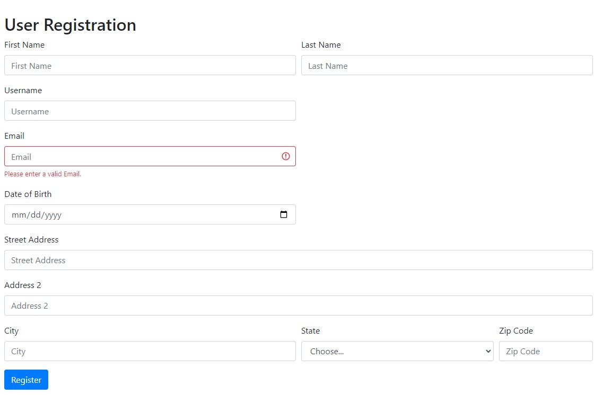

# UI Unit Testing for User Registration Assignment

### Objective

The primary objective of this assignment is to introduce you to UI unit testing, emphasizing the unique aspects of UI testing compared to backend testing.

You will be writing code and tests for submitting the user registration form. You will not be writing any code or tests for showing the user registration form.

### User Registration Form

Like the previous assignment, the registration form includes the following fields:

1. **Username**: A unique username for the user (Validation required).
2. **First Name**: User's first name (Validation required).
3. **Last Name**: User's last name (Validation required).
4. **Address**: Comprising of:
    - **Street**: User's street address (Validation required).
    - **Street2**: Additional street information (optional).
    - **City**: User's city (Validation required).
    - **State**: User's state (Validation required).
    - **Zip Code**: User's zip code (Validation required).
5. **Email Address**: User's email address (Validation required and must be unique across users).

### Requirements

1. Implement the UI to collect the user registration form. 
2. Show an error message if the input is invalid as soon as the user leaves the field
3. Each form fiels should have a label
4. Submit the form to the backend. For this assignment use a mock endpoint. See apiService.js for example.
5. Show a success message if the form is submitted successfully
6. Show an error message if the form is not submitted successfully
7. Assume the server validates if the username is unique and address is a valid address. The client code should handle the error message from the server and show the appropriate error message to the user.

### Local Dev setup
* You will need node and npm installed on your machine. (The starter code was tested on Node v18 and npm 8)
* Run `npm install` to install all the dependencies
* Run `npm run dev` to start the local dev server and run tests
* Open http://localhost:8080/ in your browser to see the UI
* Use the included code as a starting point. You can add additional files if needed.
* Don't use any framework or library. Use plain javascript.
* Use Vitest as the testing framework. You can use any other tools that come with Vitest if needed.
* Boostrap is included via a script tag. 

### Input Validation

Same as the backend unit testing assginement

* First name, Last name. Should not be empty. Should have a max length of 256 characters. Alphabetic characters, spaces, and possibly hyphens or apostrophes.
* Email address. Should have username@domain.com format. An email address can contain letters, numbers, dots ".", hyphens "-", hash "#" and underscores "_."
* Phone number - ten digit numbers
* Address - made up of street address, address line 2, city, state/province/region, country, zip code. Each sub field should not have more than 256 alphanumeric characters. (In the next assignment you will make api calls to verify if the address is a real address)
* Date of Birth - Should be a valid date in the past. (Updated on 10/10) - Accept the date as a string in format "MM/DD/YYYY".  

## Grading (5 Points)

The assignment is gradable and carries a total of 5 points. The grading criteria are as follows:

1. **UI Component Testing (1 point)**
   - Verify the correctness of UI components, including labels and input acceptance
   - Use snapshot testing to verify the correctness of UI components

2. **Input Validation (1 points)**
   - Create test cases to validate user input for each field, including username, first name, last name, email address, and address details.
   - Label tests clearly as "Positive" or "Negative" test cases to indicate whether they are testing expected behavior or invalid inputs.

3. **Form Submission Testing (2 point)**
   - Test cover the following scenarios:
   - User registration form correctly processes and submits user registration details to server
   - Test form behavior with valid and invalid data
   - Validate inputs before submitting to server
   - Handle various error scenarios from the server (invalid addrres, duplicate username, etc) and show appropriate error messages to the user
 
4. **Code Quality and Documentation (1 point)**
   - Test code organized in arrange act assert pattern
   - All functions in code and tests have JSDOC comment explaining the purpose of the function

## Late Submission Policy
   - 1 point deducted for first 24 hours
   - 2 points deducted for submission after 24 hours
---

